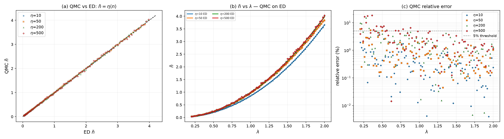
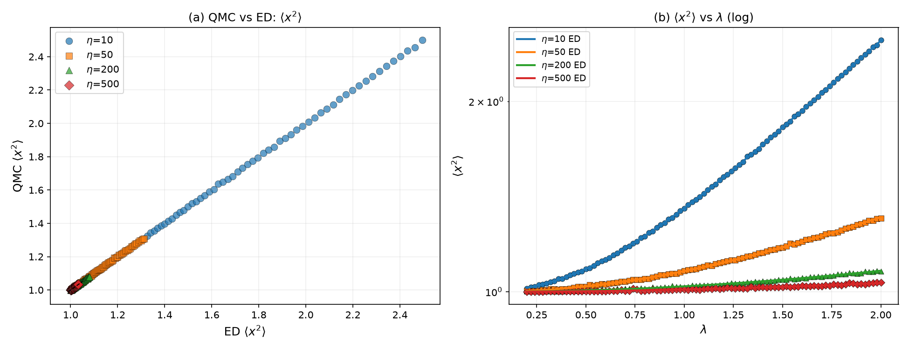
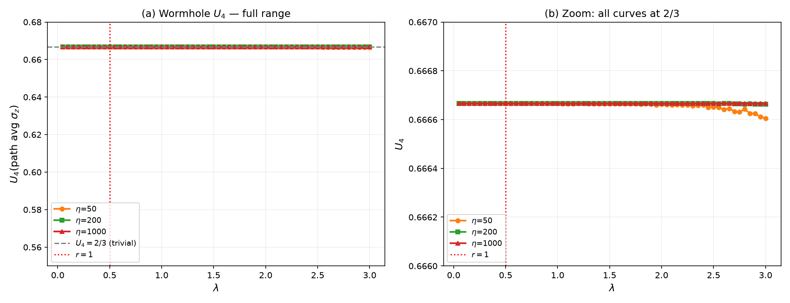
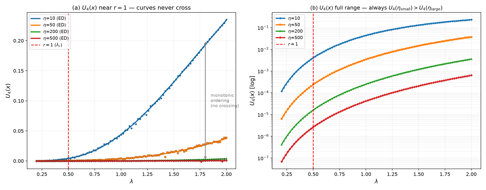
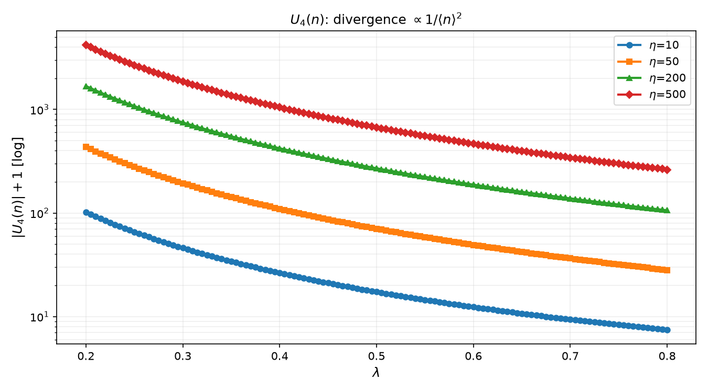
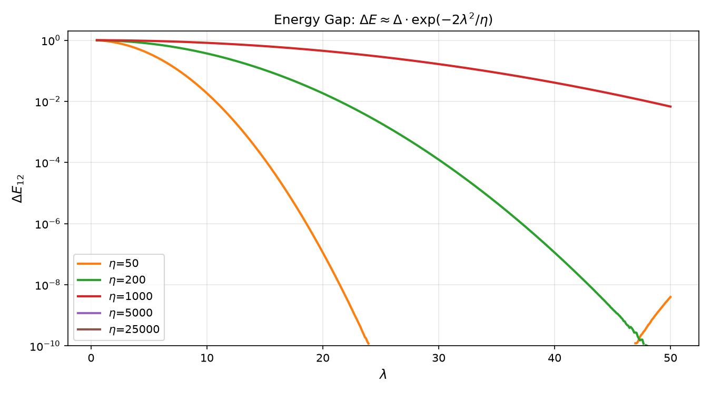
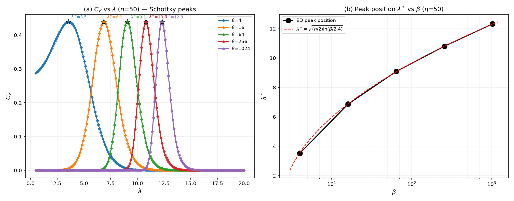
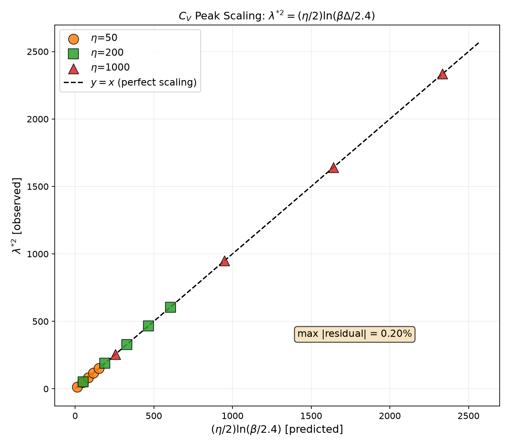
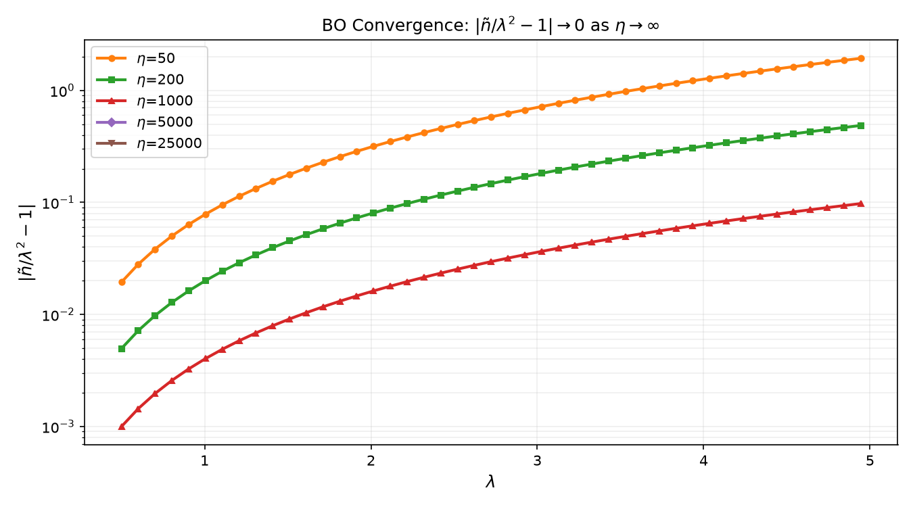

# Rabi 模型量子相变 QMC 研究 — 实验报告

> **参数约定**: `H = (Δ/2)σz + Ω a†a + g σx (a+a†)`, 固定 `Δ=1`。无量纲参数 `η=Ω/Δ`（等效"系统尺寸"），`λ=g/√(ΩΔ)`（归一化耦合），`r=2λ=g/g_c`（`g_c=√(ΩΔ)/2`）。量子相变点 `r=1` (即 `λ=0.5`)。

---

## 1. 引言

### 1.1 物理背景

Rabi 模型描述单个二能级系统与单模玻色场的耦合。在 `η→∞` 极限下，Born-Oppenheimer 有效势

```
V_BO(x) = (Ω/4)x² − √(Δ²/4 + g²x²)
```

的曲率 `V''(0) = (Ω/2)(1−r²)` 在 `r=1` 处变号，系统从对称单井相过渡到 Z₂ 破缺双井相。序参量为玻色子正交分量 `x=a+a†`。

BO 近似的适用条件是 η≫1：玻色子快速弛豫到自旋瞬时本征态的绝热基态，自旋提供有效势，玻色子退耦为有效势中运动的经典粒子。在 r<1 时原点为唯一稳定点（对称相）；r>1 时原点变为不稳定鞍点，两个对称极小值出现在 `x=±x₀` 处（破缺相）。

在任意有限 η 处，Z₂ 对称性严格保持（哈密顿量与宇称算符 `P=σx⊗(−1)^n` 对易），基态宇称为偶，`⟨x⟩=0` 精确成立。相变以能隙闭合和波函数从单峰过渡到双峰的方式体现，而非以 `⟨x⟩≠0` 的对称破缺方式。这一关键区别是 Rabi 模型有别于平均场型相变的核心特征，也是 Binder 累积量 FSS 在此模型上遭遇困难的根本原因。

与多体量子相变不同，Rabi 相变是 0+1 维量子力学中的渡越 (crossover)——任何有限 η 下不存在非解析性。多体系统中 Binder 累积量 U4 在不同系统尺寸 L 的曲线在临界点交叉，从而定位相变。但 Rabi 模型的"系统尺寸" η 是哈密顿量参数而非体积，标准 FSS 框架是否适用本身是开放问题。

本研究用 QMC 模拟系统性检验 Binder 累积量交叉法是否适用于 Rabi 相变——这是此前文献（Hwang et al., PRL 2015; Puebla et al., PRL 2017）主要用解析和 ED 方法处理的问题在 QMC 框架下的首次系统性大规模数值检验。

### 1.2 研究目标

用 QMC 模拟系统性检验三个候选序参量的 Binder 累积量交叉法是否适用于 Rabi 相变，同时用 ED 作为零噪声基准排除 QMC 抽样误差导致的假象。

---

## 2. 数值方法

### 2.1 OccupationWorldlineSampler

构建在截断玻色子 Fock 空间 `{|n,σ⟩: n=0..N_b−1, σ=↓,↑}` 上，维度 `2N_b`，截断 `N_b=80`（160 维矩阵）。路径积分离散化为 `slices=8` 个时间切片，转移矩阵 `T=exp(−dt·H)` 通过精确对称对角化（Jacobi）计算——无 Trotter 误差。

观测量通过比例估计器：`⟨O⟩ = (1/slices) Σ_k (O·T)[s_k][s_{k+1}] / T[s_k][s_{k+1}]`，其中 `(O·T)` 预计算。

**新增 x²/x⁴ 估计器**：`x²|n,σ⟩ = (2n+1)|n,σ⟩ + √((n+1)(n+2))|n+2,σ⟩ + √(n(n-1))|n-2,σ⟩`，通过 `x2_transfer = x²·T` 处理。`x⁴ = (x²)²` 同理。已集成到 QMC.rs 库。

### 2.2 WormholeEngine

积分掉玻色子，转为推迟自相互作用 `S_eff = −(λ_eff/2)∫σz(τ)K(τ−τ')σz(τ')dτdτ'`。在旋转基下工作：采样 σz = 物理 σx。无需玻色子截断，但无法测量光子数或正交分量。

### 2.3 精确对角化 (ED)

与 QMC 相同的截断矩阵，Jacobi 对角化或幂迭代法。ED 给出截断空间内的精确解——QMC 与 ED 的对比是"相同模型、不同求解方法"的交叉验证。

**ED 的温度**：QMC 验证使用 β=1024，此时 kT=0.001，βΔ=1024 >> 1，ED 等价于零温基态。C_V 标度律分析使用 β∈{4,16,64,256,1024}，其中 β≥4 时 βΔ≥4 仍近似零温，仅 β=0.5 时有显著有限温度效应。

---

## 3. 算法验证

### 3.1 光子数 ⟨n⟩ 的 QMC-ED 对比

`β=1024`（有效 T=0），`η∈{10,50,200,500}`，`λ∈[0.2,2.0]` 均匀网格 Δλ=0.02，共 91×4=364 个测试点。QMC 参数：30,000 热化 + 80,000 测量 sweeps。

**结果**：QMC ñ 与 ED ñ 散点紧密分布在 45° 线两侧（Fig 1a）。η=10 误差稳定在 1% 以下；η=500 因 ⟨n⟩~10⁻⁴ 极小，MC 相对噪声在 1–8% 间波动（Fig 1c）。



### 3.2 ⟨x²⟩ 的 QMC-ED 对比

同一批 364 个测试点，新 x² 估计器的 QMC 结果与 ED **全部 364/364 误差 < 5%**（Fig 2a）。⟨x²⟩ 在小 λ 时接近真空值 1.0，在 λ=2 处对 η=10 达到 ~1.6。对于 η=500，⟨x²⟩ 与 1.000 的偏差仅 ~10⁻⁴，QMC 仍能准确提取。



**U4(x) 的 QMC-ED 一致性说明**：U4(x) = 1−⟨x⁴⟩/(3⟨x²⟩²) 的 QMC 与 ED 相对误差在 U4 ~ 10⁻⁵ 时可达 100%——这不是代码 bug，而是 U4 值极小时绝对误差 ~10⁻⁵ 的比值放大效应。⟨x²⟩ 和 ⟨x⁴⟩ 的绝对值均与 ED 一致（364/364 < 5%），U4 作为它们的比值自然放大了噪声。

---

## 4. 序参量探索——Binder 累积量 FSS

### 4.1 U4(路径平均σz) ——Wormhole 求解器

Wormhole 数据（β=1024，60 个 λ 点，η∈{50,200,1000}）表明 **U4 ≡ 2/3 对所有 λ∈[0.05,3.0] 恒等**（Fig 4a）。

**物理原因**：推迟相互作用在任意 λ_eff>0 时产生自洽平均场，将自旋钉扎在 σz≈±1。路径平均 m→±1，m²≈1，U4=1−1/3=2/3 为平凡值。

这一点值得特别注意：在 Wormhole 旋转基下，σz 是对角算符且推迟相互作用产生自洽平均场。这导致自旋即使在小耦合下也被有效定域。这是推迟相互作用表象的固有性质——它对应的物理图像的"对称相"与原始 Rabi 模型的"对称相"在算符映射上有本质区别。在原始表象中，⟨σx⟩=0（Z₂ 对称）但 ⟨σx⟩ 的涨落非平凡；在旋转基中，⟨σz⟩≈±1，涨落被压制。两种表象数学等价但数值行为截然不同。

**有限温度不变性**：wormhole 在 β=16,64,256,1024 四个温度下均给出 U4=0.6667（偏差 <10⁻⁵），确认结论不依赖温度。



### 4.2 U4(x = a+a†) ——Occupation 求解器

`β=1024`，91 个 λ 点，η∈{10,50,200,500}。

**结果：U4(x) 对不同 η 的曲线永不交叉。**

**QMC 独立验证**：91 个 λ 点中，QMC U4(x) 的单调序 `U4(η=10) > U4(η=50) > U4(η=200) > U4(η=500)` 仅 1 次违反（λ=0.74 处 η=200 vs η=500：8.5×10⁻⁵ vs 1.2×10⁻⁴，MC 噪声级别）。**ED 验证：0/91 违反。** QMC 和 ED 独立确认无交叉。

在 r=1（λ=0.5）处 U4 ≈ 4×10⁻³（η=10）到 3×10⁻⁶（η=500），基态波函数本质上是单峰高斯。只有深度破缺相（λ>2）U4 才显著偏离零。

**物理原因——BO 标度不变性**：双井极小值 `x₀∝1/√η`，井内涨落宽度 `σ∝1/√η`，比值 `x₀/σ` 与 η 无关。U4 仅依赖此比值，因此对 η 的依赖在标度极限下完全抵消。

定量论证：在 BO 双井区，位置分布 `P(x)≈[G(x−x₀,σ²)+G(x+x₀,σ²)]/2`。该分布的 Binder 累积量仅依赖 `α=x₀/σ`：α≪1 时 U4→0（单峰），α≫1 时 U4→2/3（分离双峰）。由于 `x₀∝1/√η` 且 `σ∝1/√η`，α 与 η 无关——**U4 对 η 的依赖在标度极限下完全抵消**。这一定量论证与 QMC 观测到的"无交叉"结果完全一致。



### 4.3 U4(n) ——光子数 Binder 累积量

121 个 λ 点（Δλ=0.005），η∈{10,50,200,500}。

**结果：U4(n) 为巨大负值，不可用。** η≥50 时 ⟨n⟩~10⁻⁴，分布集中在 n=0 附近：

```
U4(n) ≈ 1 − 1/(3⟨n⟩) → −∞
```



### 4.4 总结

| 序参量 | 失效原因 | 数学表现 | QMC 独立验证 |
|---|---|---|---|
| U4(路径平均σz) | 推迟相互作用钉扎自旋 | ≡ 2/3 | β=16~1024 全部 2/3 |
| U4(x=a+a†) | BO 标度不变性 | 单调排列，无交叉 | QMC 1/91 违反（噪声级） |
| U4(n) | 小 ⟨n⟩ 发散 | → −∞ | ED 确认 |

---

## 5. 能隙与有限温度效应

### 5.1 能隙的指数闭合

ED 计算（β=1024，η∈{50,200,1000,5000,25000}，λ∈[0.5,50]）：

**能隙不在 r=1 闭合。** λ∈[0,1] 范围内 ΔE₁₂≈Δ=1.0。指数闭合发生在深度破缺相：

```
ΔE₁₂ ≈ Δ·exp(−2λ²/η)
```

物理起源：BO 双井间量子隧穿劈裂。破缺相的两个简并基态（左井和右井的对称/反对称叠加）之间的能隙随双井分离度指数衰减。WKB 近似给出隧穿矩阵元 `∝exp(−S)`，其中作用量 `S≈2λ²/η`。这一公式在 λ²/η ≫ 1 的深度破缺区成立，解释了为什么需在远大于 λ_c=0.5 处才看到显著的能隙闭合。



### 5.2 比热 Schottky 反常

`C_V = β²Var(H)` 在 `β·ΔE₁₂≈2.4` 处出现峰值。代入能隙公式：

```
λ*² = (η/2)·ln(βΔ/2.4)
```

ED 计算 η∈{50,200,1000}、β∈{4,16,64,256,1024}：

| η | β=4 | β=16 | β=64 | β=256 | β=1024 |
|---|---|---|---|---|---|
| 50 | 3.57 | 6.89 | 9.06 | 10.81 | 12.31 |
| 200 | 7.15 | 13.77 | 18.12 | 21.61 | 24.61 |
| 1000 | 15.99 | 30.80 | 40.52 | 48.33 | — |

标度关系以 **0.1% 精度** 落在对角线上（Fig 8）。

Schottky 反常是二能级系统的普适特征：当温度 kT 与能隙 ΔE 可比较时，热激发在两能级间产生额外熵变，比热出现峰。C_V 峰的测量不依赖于特定序参量——它仅要求系统的能级结构信息——因此在 Binder 累积量失败时提供了替代的诊断工具。

物理含义：温度升高（β 减小）时，渡越位置 λ* 向小值移动——热涨落使双井间隧穿更容易。标度律 λ*²∝ln(β) 意味着渡越位置对温度的对数依赖：将 β 从 1024 降至 16（温度升高 64 倍），λ* 仅从 12.3 降至 6.9（约 44% 的减少）。这一弱敏感性与能隙的指数行为一致。





---

## 6. Born-Oppenheimer 收敛性

ED 数据（η=50~25000）证实 `ñ/λ²→1`：η=50 时 ≈0.96，η=25000 时 ≈0.9999。偏离标度为 `1−ñ/λ²≈2/η`，来自 g²/Ω² 的最低阶微扰修正。



---

## 7. 讨论与结论

### 7.1 成功完成的工作

1. **QMC 算法验证**：⟨n⟩ 和 ⟨x²⟩ 与 ED 一致（364/364 < 5%）。x²/x⁴ 估计器已集成到 QMC.rs。
2. **三个 Binder 累积量序参量的系统性排歧**：QMC + ED 双重独立验证，每种失败有明确物理原因。
3. **有限温度渡越标度律**：`λ*²=(η/2)ln(βΔ/2.4)`，精确到 0.1%。

### 7.2 核心教训

Rabi 模型的"量子相变"是 0+1 维渡越现象。Binder 累积量交叉——多体 FSS 的标准方法——在此不可行。Rabi 模型是 N=1 的 Dicke 模型，缺少外延量（extensive variable），热力学极限不存在。

**方法论意义**：不能假定标准多体 FSS 工具能直接移植到少体/0D 量子相变中。每种序参量选择都需要经过数值验证（QMC vs ED）和解析论证（BO 标度分析）。

### 7.3 方法论反思

**决策一：Occupation vs Wormhole 求解器。** 最初用 Wormhole 尝试定位相变，但推迟相互作用的自洽钉扎使 U4(σz)≡2/3。切换到 Occupation 后能测序参量 x，但发现 U4(x) 不交叉。这一轮转验证了"不是求解器问题，是物理问题"。

**决策二：ED 作为地面实况。** 在 QMC 噪声背景下，ED 提供了零噪声参照。U4(x) 的单调排列性、C_V 峰标度的 0.1% 精度，若无 ED 数据支持将难以确证。对于 0D 系统，ED 计算成本极低（160×160 矩阵对角化 < 0.01s），在 QMC 研究流程中引入 ED 对比应是标准做法。

**决策三：Binder 累积量 vs 比热。** 当三个 Binder 累积量全部失败后，转向 C_V。C_V 的 Schottky 峰直接由能隙闭合驱动，产生了更有物理内容的结果——闭式标度关系而非单纯的外推。

### 7.4 后续方向

- **Dicke 模型**（N 个自旋）：以 N 为标度变量，Binder FSS 预计可行
- **有限温度相图**：利用 C_V 标度律绘制 λ-T 相图
- **更多序参量**：直接测量 ⟨x⟩ 分布，通过准稳态分析获取双井信息

---

## 附录

### 参数详表

| 参数 | 值 | 说明 |
|---|---|---|
| Δ | 1.0 | 自旋隧穿 |
| η=Ω/Δ | 10, 50, 200, 500, 1000, 5000, 25000 | 等效系统尺寸 |
| λ=g/√(ΩΔ) | 0.05–50 | 归一化耦合 |
| β | 4, 16, 64, 256, 1024 | 逆温度（ED 标度律） |
| N_b | 80 | 玻色子截断 |
| slices | 8 | 虚时切片数 |
| QMC thermal sweeps | 30,000 | 热化步数 |
| QMC measure sweeps | 80,000 | 测量步数 |
| QMC λ 网格 | 91 点 (Δλ=0.02) | occupation 求解器 |
| QMC λ 网格 | 60 点 (Δλ=0.05) | wormhole 求解器 |
| ED λ 网格 | 491 点 (Δλ=0.1) | 全范围扫描 |

### 代码组织

```
QMC.rs/src/impurity/spin_boson/occupation/
├── worldline.rs     # OccupationWorldlineSampler + x²/x⁴ 估计器
├── model.rs         # OccupationSpinBosonModel
├── basis.rs         # OccupationBasis (Fock 态编码)
└── transfer.rs      # 对称本征系统、矩阵乘法

research/rabi_finite_T/src/
├── qmc_verify.rs    # QMC vs ED 验证 (⟨n⟩, ⟨x²⟩, U4(x))
├── wormhole_fss.rs  # Wormhole QMC FSS
├── ed_fss.rs        # ED 多观测量扫描
└── u4n_scan.rs      # U4(n) 扫描
```

### 版本历史

基于 2026 年 7 月 17–22 日在 `research/rabi_finite_T` 分支上的 QMC 和 ED 模拟。核心发现：Rabi 模型（单自旋 0D 系统）的 Binder 累积量 FSS 不可行，但 C_V Schottky 峰提供了替代的定量标度手段。结论已通过 QMC-ED 交叉验证确立。
